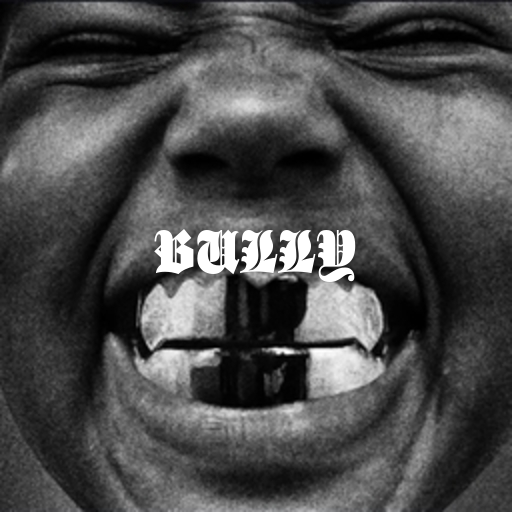
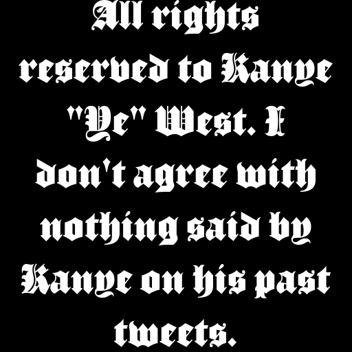

# BULLY TEXT and COVER GENERATOR

    A little Python script that i made that generates Ye's Bully cover. That is ugly and simple btw.
    
    

## Requirements:
* Python (https://www.python.org/downloads/)
* Pillow (pip install pillow)

### Credits:
* Font: "Luke Thick400"
* Album cover: Kanye West

* All rights reserved to Kanye West. I don't agree with nothing that Ye said on his past tweets.